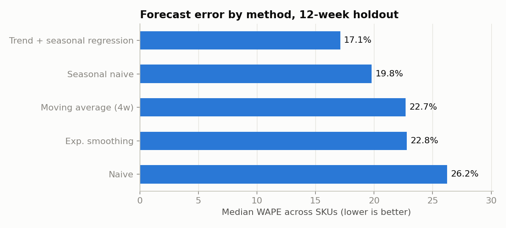
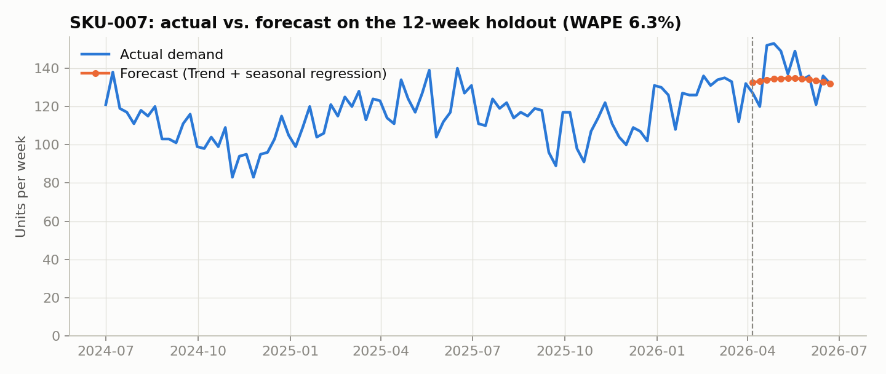
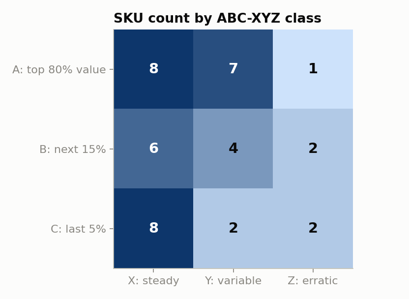

# StockWise: Demand Forecast & Inventory Planner

Forecasts weekly demand for 40 SKUs, picks the most accurate method for each one, and converts the forecast into a buy list: safety stock, reorder point, order quantity, and which SKUs need a purchase order today.

Built with Python (pandas, NumPy, matplotlib). No external data or API keys needed.

> **Data note:** the dataset is synthetic. `src/generate_data.py` simulates two years of weekly demand with a fixed seed, so every number below is reproducible but is not from a real company.

## The question it answers

A planner with 40 SKUs has to decide every week: *what do I reorder, and how much?* That depends on three things this project works out in order:

1. **How much will we sell?** A demand forecast per SKU.
2. **How wrong could that forecast be?** Forecast error drives safety stock.
3. **How important is the SKU?** High-value items get a higher service level.

## Results

| Metric | Value |
|---|---|
| Median forecast error (WAPE), naive baseline | 26.2% |
| Median forecast error (WAPE), best method per SKU | 14.7% |
| SKUs flagged for reorder | 13 of 40 (8 are class A) |

The trend + seasonal regression was the most accurate method for 26 of the 40 SKUs.







The full buy list is in [`outputs/inventory_policy.csv`](outputs/inventory_policy.csv), one row per SKU with its class, forecast, safety stock, reorder point, weeks of cover and suggested order quantity.

## How it works

**1. Forecast backtest.** The last 12 weeks are held out. Five methods forecast those weeks from the earlier history, and each is scored with WAPE (weighted absolute percentage error) and bias:

- Naive (last value)
- 4-week moving average
- Exponential smoothing
- Seasonal naive (same week last year)
- Linear trend + annual seasonality, fitted by least squares

The method with the lowest WAPE is selected for each SKU.

**2. ABC-XYZ classification.**

- ABC ranks SKUs by annual value: A is the top 80% of spend, B the next 15%, C the last 5%.
- XYZ ranks by demand variability (coefficient of variation): X below 0.25, Y up to 0.5, Z above.

**3. Inventory policy.**

- Service level by class: A 98%, B 95%, C 90%
- Safety stock = z × √(LT × σ_d² + d² × σ_LT²), using forecast error as σ_d so it covers both demand and lead-time variability
- Reorder point = forecast weekly demand × lead time + safety stock
- Order quantity = EOQ = √(2 × annual demand × order cost / holding cost per unit)
- A SKU is flagged `REORDER` when on-hand stock is at or below its reorder point

## Run it

```bash
python -m venv .venv && source .venv/bin/activate
pip install -r requirements.txt
python src/generate_data.py   # writes data/
python src/planner.py         # writes outputs/
```

## Project layout

```
data/      sku_master.csv, weekly_demand.csv (generated)
src/       generate_data.py, planner.py
outputs/   forecast_backtest.csv, inventory_policy.csv, charts
```

## Limitations

- The data is simulated, so the accuracy numbers show the method working, not real-world performance.
- The best method is chosen on a single 12-week holdout. A rolling-origin backtest would give a more reliable choice.
- On-hand stock ignores open purchase orders already in transit.
